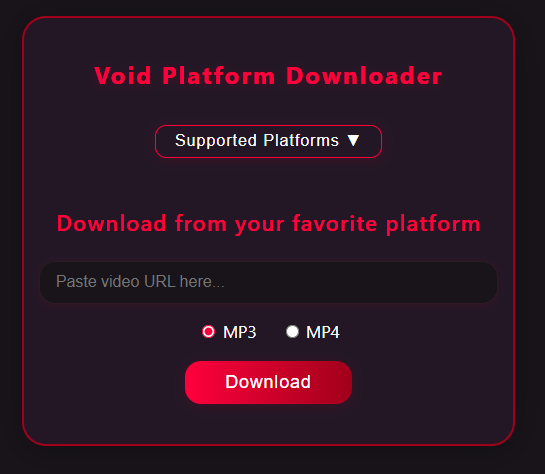

<h1 align="center">
  🚀 Void Platform Downloader
</h1>

<p align="center">
  <b>A modern, dark-themed web app for downloading audio (MP3) or video (MP4) from YouTube and 100+ other platforms.<br>
  Powered by Flask, yt-dlp, and pure awesomeness.</b>
</p>

<div align="center">
  
  
  
</div>

<br>
<p align="center">
  
</p>
<details>
<summary><b>✨ Features</b></summary>

- Download MP3 or MP4 from a huge range of sites (YouTube, SoundCloud, Vimeo, Facebook, Twitter, TikTok, Instagram, and more)
- Beautiful, centered dark/red UI with smooth fade-in and pop animations
- Dropdown menu for supported platforms
- Direct download after conversion
- Unique download folders for every session
- Super fast, super easy, super clean

</details>

<details>
<summary><b>📸 Screenshots</b></summary>

<p align="center">
  
</p>

</details>

<details open>
<summary><b>⚡ Quickstart</b></summary>

```bash
pip install flask yt-dlp imageio-ffmpeg
python app.py
# Then open http://127.0.0.1:5000 in your browser
```

</details>

<details>
<summary><b>🛠️ Usage</b></summary>

1. Paste a video URL from a supported platform.
2. Choose MP3 or MP4.
3. Click <b>Download</b>.
4. Watch the magic happen. Your file will be ready in seconds!

</details>

<details>
<summary><b>🌐 Supported Platforms</b></summary>

- YouTube
- SoundCloud
- Vimeo
- Facebook
- Twitter
- TikTok
- Instagram
- ...and <a href="https://github.com/yt-dlp/yt-dlp/blob/master/supportedsites.md">hundreds more</a>

</details>

<details>
<summary><b>💡 Notes</b></summary>

- All downloads are processed server-side and sent directly to your browser.
- For the full list of supported sites, see the <a href="https://github.com/yt-dlp/yt-dlp/blob/master/supportedsites.md">yt-dlp supported sites</a>.

</details>

<br>

<h2 align="center" style="color:#e53935; animation: popin 1.2s cubic-bezier(.68,-0.55,.27,1.55);">This project is <b>F****** amazing</b>. 🚀🔥</h2>
